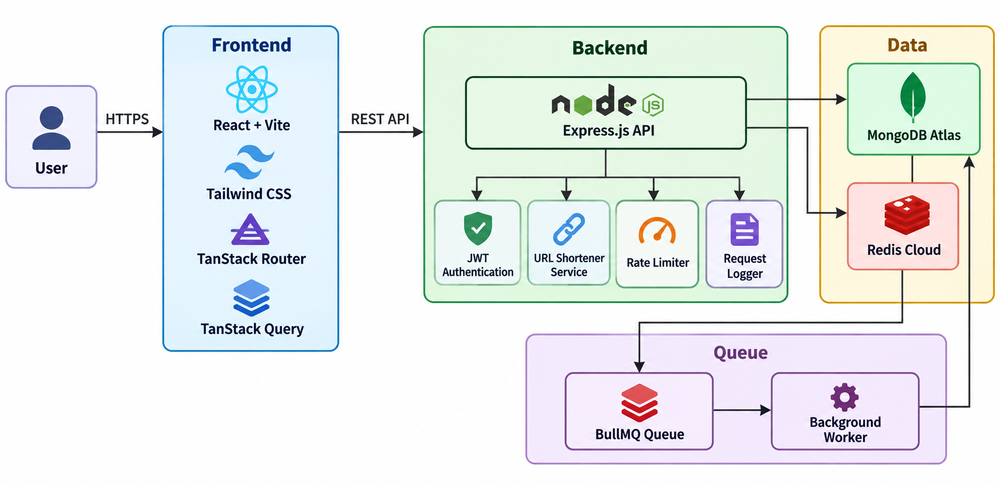
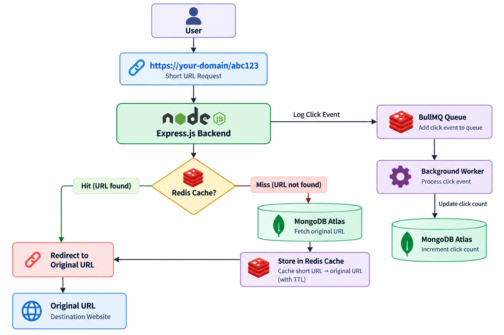
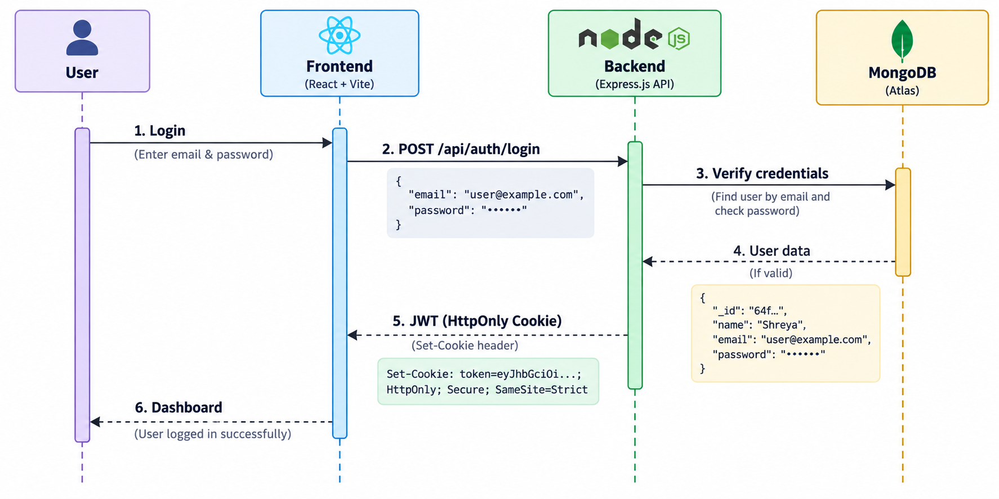
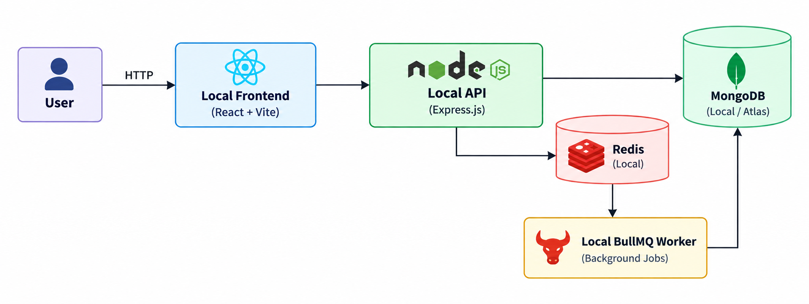
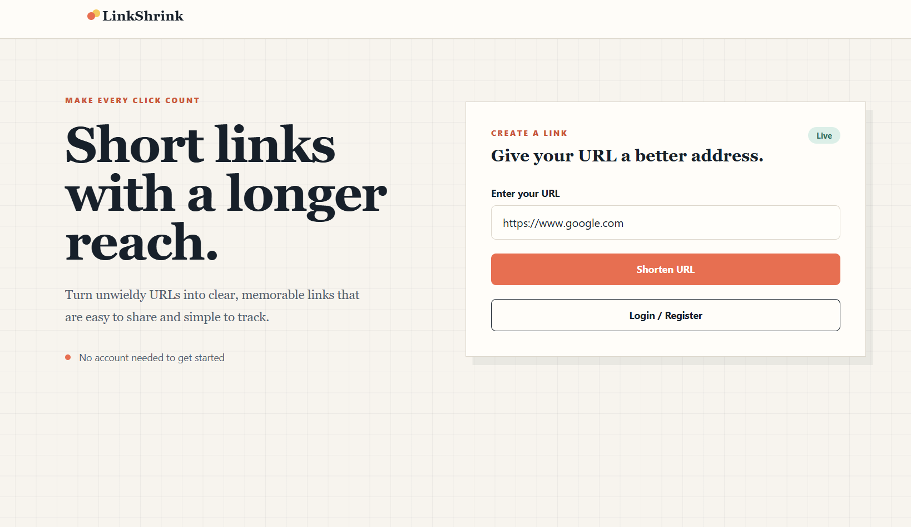
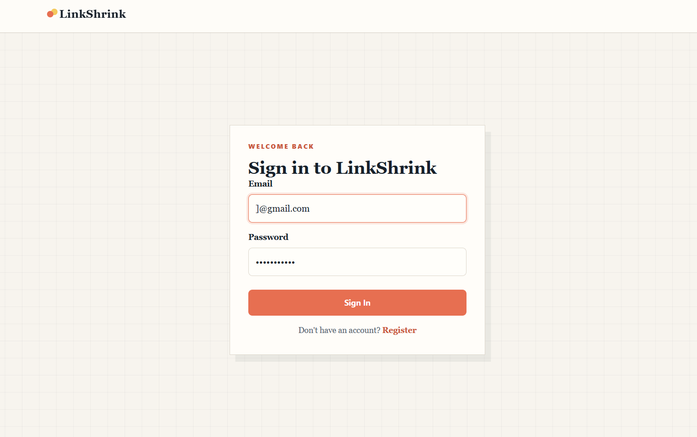
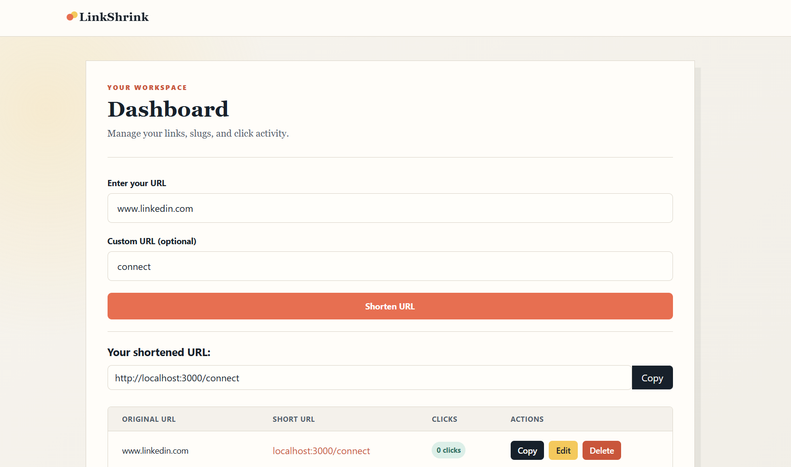
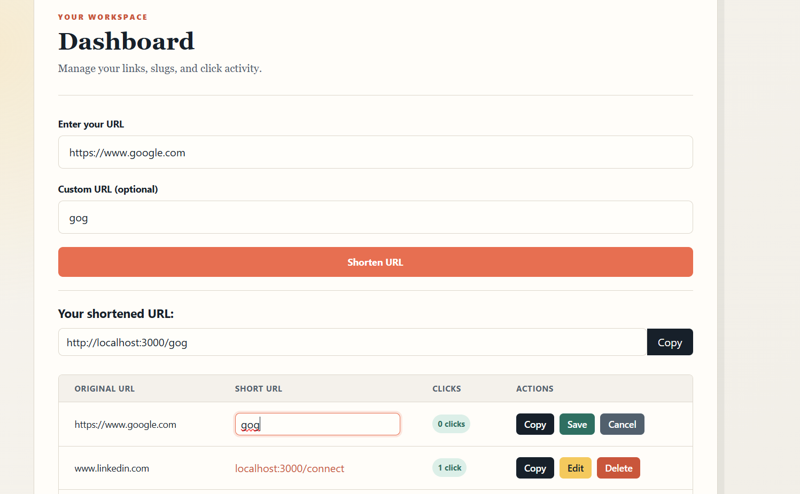
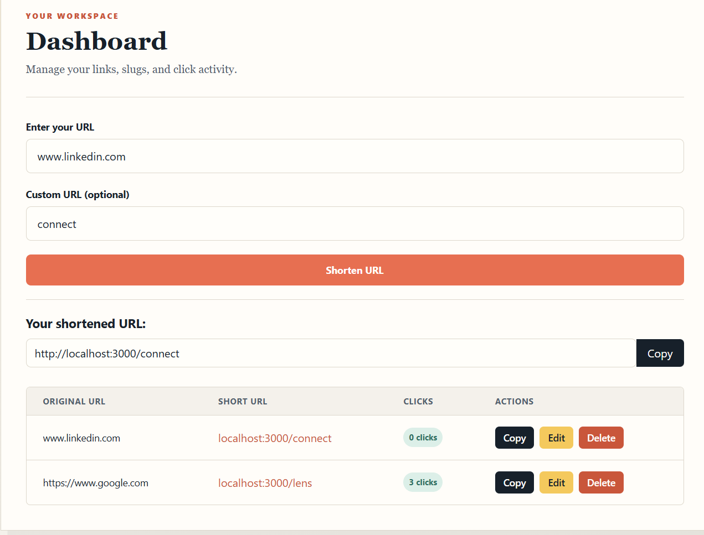

# 🔗 LinkShrink

A full-stack URL management application built with **React**, **Node.js**, **Express**, **MongoDB**, **Redis**, and **BullMQ**.

It supports secure authentication, anonymous and authenticated URL shortening, Redis-powered caching, asynchronous click analytics, and a modern dashboard for managing shortened URLs. It is designed with scalability, performance, and clean architecture in mind.

---


## ✨ Features

 🔐 JWT Authentication using HttpOnly Cookies
 🔗 Anonymous URL Shortening
 👤 User Registration & Login
 ✏️ Custom Short URLs
 ⚡ Redis Caching for Fast Redirects
 🚀 BullMQ Background Worker
 🗑️ Delete URLs
 📝 Edit Custom Slug
 📋 User Dashboard
 🛡️ Rate Limiting
 📄 Request Logging


---

## 🛠️ Tech Stack

| Category | Technology |
|----------|------------|
| Frontend | React, Vite, Tailwind CSS |
| Backend | Node.js, Express.js |
| Database | MongoDB Atlas |
| Cache | Redis Cloud |
| Queue | BullMQ |
| Authentication | JWT + HttpOnly Cookies |
| Routing | TanStack Router |
| Data Fetching | TanStack Query |
| State Management | Redux Toolkit |
| Local runtime | Node.js, Docker Compose |

---

### Performance Optimizations

- ⚡ Redis caching reduces repeated MongoDB lookups.
- 🚀 BullMQ processes click analytics asynchronously.
- 📈 Stateless backend designed for horizontal scaling.
- 🛡️ Rate limiting protects the API from abuse.
  
## 📂 Project Structure

```
url-shortener/
│
├── FRONTEND/
│
├── BACKEND/
│
├── package.json
├── loadtest.js
└── README.md
```

---


## 🏗️ System Architecture


## 🔄 URL Redirection Flow


## 🔐 Authentication Flow



## 💻 Local Runtime




## 📸 Screenshots

### 🏠 Home Page

The landing page allows users to shorten URLs instantly without requiring authentication.



---

### 🔐 User Authentication

Secure user registration and login using JWT authentication with HttpOnly cookies.



---

### 📋 User Dashboard

A centralized dashboard where authenticated users can manage all their shortened URLs.



---

### 🔗 Create Custom Short URL

Create branded short links with custom slugs and instant validation.


---

### ✏️ Edit & Delete URLs

Update custom slugs or remove URLs directly from the dashboard.



---

### 📊 Click Analytics

Track URL performance with click analytics and usage statistics.



---

## 🏛️ System Design Decisions

### Redis Caching
- Frequently accessed short URLs are cached in Redis to minimize MongoDB queries and improve redirect performance.

### Asynchronous Click Analytics
- Click events are processed using BullMQ background workers, ensuring that analytics updates do not delay user redirects.

### Stateless Backend
- The backend is stateless, allowing multiple application instances to run behind a load balancer for horizontal scaling.

### Secure Authentication
- JWT tokens are stored in HttpOnly cookies to reduce exposure to client-side scripts.

### Database
- MongoDB Atlas is used as the primary persistent data store for users, URLs, and analytics.

# Response Status Codes

| Status Code | Description |
|------------|-------------|
| 200 | Success |
| 201 | Resource Created |
| 302 | Redirect |
| 400 | Bad Request |
| 401 | Unauthorized |
| 403 | Forbidden |
| 404 | Resource Not Found |
| 409 | Duplicate Resource |
| 429 | Too Many Requests |
| 500 | Internal Server Error |

---

# Security Features

- JWT Authentication
- Input Validation
- Password Hashing
- Protected Routes
- HttpOnly Cookies
- Rate Limiting
- Redis Caching
- Request Logging

---

## 🚀 Future Improvements

- QR Code Generation
- URL Expiration
- Password Protected Links
- Custom Domains
- Advanced Analytics

---

## 👨‍💻 Author

**Shreya Sharma**


